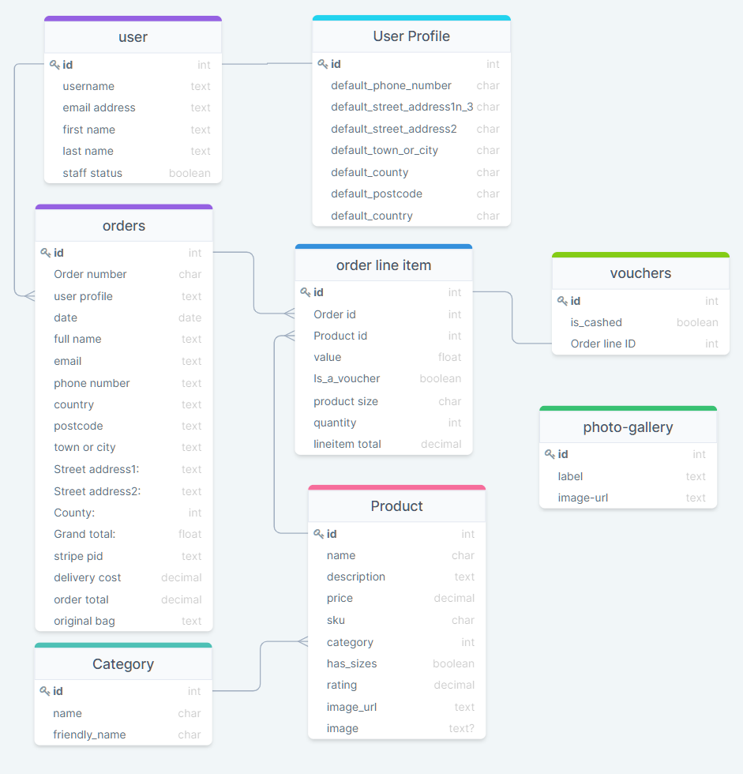
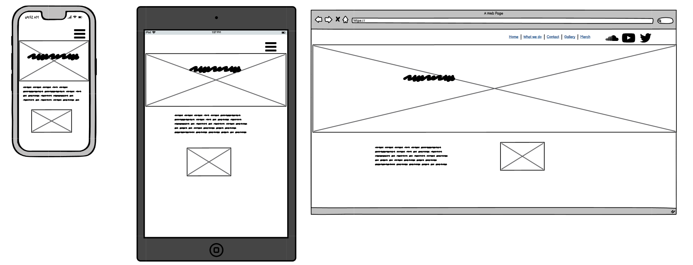
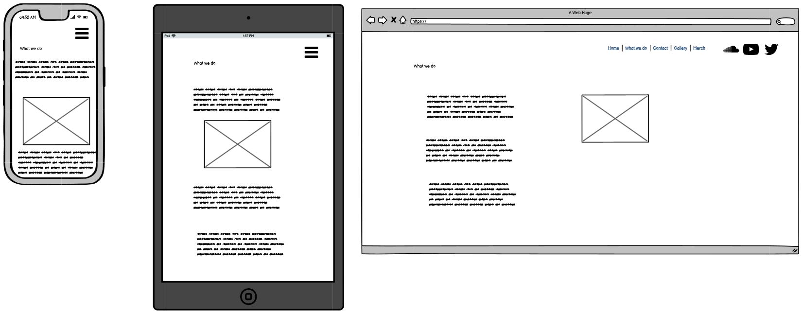
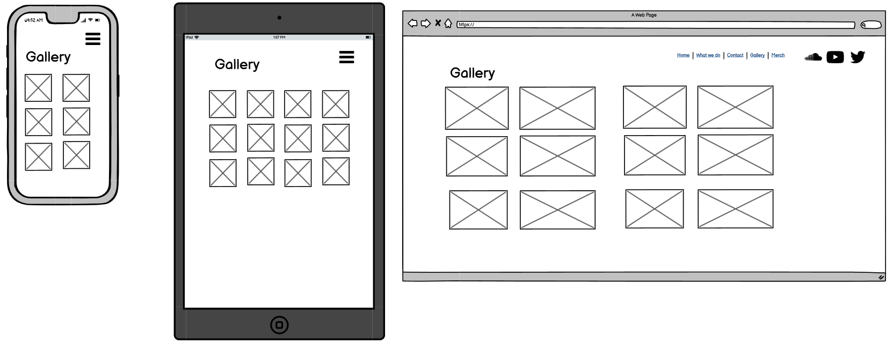
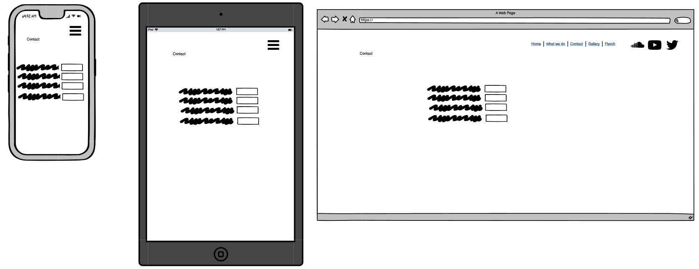

# BoWood Audio

BoWood Audio is a home recording studio that provides a wide range of audio and program editing services. This websites primary intention is to display to the visitor what the setup of the studio is like and what services are available.

## UX

### Scope

The time allocated to build this project was shorter then previous projects, luckily for me the site owner is very flexible with the scope. The site will be first made to an MVP, and if there is additional time, content/features can be added.

### Visitor Goals

1. As a visitor to this site, I want to see what services are available so I can decide if I want to do business here.
2. As a visitor to this site, I want to see pictures of the studio, so I know who what to expect.
3. As a visitor to this site, I want to be able to contact the studio, so that I can make queries or request a booking.
4. As a visitor to this site, I want to be able to view the range of products that are on sale, so that I can make an online purchase.
5. As a visitor to this site, I want to be able to view individual product details, so that I check product details before deciding to purchase.
6. As a visitor to this site, I want to be able to see and post reviews of the products on sale, so that I get a second opinion before i buy or share my opinion with other visitors.

### Owner Goals

1. As the owner of this site, I want a simple landing page, so that visitors can learn about my studio easily and quickly.
2. As the owner of this site, I want to be able to have an online store so i can sell merchandise and gift vouchers.
3. As the owner of this site, I want a receipt / proof of purchase emailed to myself and available to myself.
4. As the owner of this site, I want to showcase some of my work, so the user gets a idea of my skills and talent.

### Structure

This full stack site is put together with HTML, using the bootstrap framework along with some CSS on the frontend.

The frontend is integreated into the backend using Python and Django with a PostgreSQL Database.

### Skeleton

The page content is dynamic and composed of Jinja templates which are put together using Python Django.

#### Website page line up

- Home / Index

- What we do

- Contact

- Gallery

- Login / Logout

- Register new user

- Profile / My details / Edit my Contact details

- All products

- Product details / reviews 

- Shopping cart

- Checkout

- New product addition

### Database Schema

#### Relational Database tables schema



[image source](https://drawsql.app/code-institute-3/diagrams/ms04#)

##### Products table

```bash
_ID: (auto-generated) ObjectId PRIMARY KEY (Not changeable)
name : STRING

```

#### Wireframes of pages

#### Home



#### What we do



#### Contact



#### Gallery



### Surface

#### Colours

Colours were sourced from a work in progress design on a branding and logo for BoWood Audio.

Mainly Dark mode using

#323232 - Graphite

#BB3C2B - Tall poppy

#F5CA9F  - Manhattan

#CCB19E -  Rodeo Dust


#### Icons

Font Awescome is used for icons

#### Images

Images are sourced from unsplash and site owner.

#### Fonts

The font used is Oswald from Google fonts.


## Features

### Existing Features

- Online Shop purchases payment can be accepted using the Stripe API

- Messages inputed on the Contact form are emailed to the site owner

- Photo gallery is connected to a database table, so it can be updated by the site owner on an admin portal 

- Visitors have full CRUD access to product reviews they submit.

-

- 


### Features Left to Implement

- Gift voucher handling

## Technologies Used

### Frontend

#### Languages

- HTML
- CSS
- Python
- JavaScript/Jquery

#### Libraries and Frameworks

- [Bootstrap](https://getbootstrap.com/)
- Django
- [Jinja](https://jinja.palletsprojects.com/en/2.11.x/)
- Fonts : [Google Fonts](https://fonts.google.com/)
- Icons : [FontAwesome](https://fontawesome.com/v5.15/icons?d=gallery&p=1)

#### Tools

##### Productivity

- [Notion](https://www.notion.so/) : I use Notion for documenting personal notes , planning and scheduling work.
- [Zen mode](https://play.google.com/store/apps/details?id=com.oneplus.brickmode&hl=en_IE&gl=US): Great Android phone app to restrict my phone from distracting me when i need to get work done.
- Pomodoro timer : [Tomato Clock](https://chrome.google.com/webstore/detail/tomato-clock/enemipdanmallpjakiehedcgjmibjihj) is perfect for keeping my work progressing while also making me take breaks!. :smiley:

##### Toolbox

- JSfiddle : I used this online sandbox to build and play code before i adding to the project.
- [Python Tutor](http://pythontutor.com/): I used this very handy online sandbox for experimenting with Python code before applying to this project.
- Wireframe: [Balsamiq](https://balsamiq.com/)
- DB Schema diagram : [Drawsql.app](https://drawsql.app/code-institute-3/diagrams/ms04#)
- IDE: [Visual Studio Code (VS Code)](https://code.visualstudio.com/).
- Virtual Environment : [Pipenv](https://pipenv.pypa.io/en/latest/)
- Version control: Git
- Kanban planner : [Github projects](https://github.com/kenwals/BoWood-Audio/projects/1).
- Markdown editor: [Typora](https://typora.io/) was used when appropriate, VS code editor was used for most updates.
- Markdown Preview Github Styling : this brilliant vscode extension helps me read my markdown in Github format.
- File renaming utility: PowerRename from [PowerToys on Windows 10](https://www.windowscentral.com/how-bulk-rename-your-files-windows-10-powertoys)
- Favicon creator : [favicon.io](https://favicon.io/favicon-generator/) **
- Autoprefixer CSS : [Autoprefixer](https://autoprefixer.github.io/)
- Auto formatter for HTML, CSS and JS:  [webformatter](https://webformatter.com/html)
- px to rem convertor : [nekoCalc](https://nekocalc.com/px-to-rem-converter)
- JavaScript linter : [jshint](https://jshint.com/)
- Python linter :  [Pep8 online](http://pep8online.com/)
- Markdown linter : markdownlint extension on VS Code.
- Colour names : [Name that color](https://chir.ag/projects/name-that-color/#6195ED)
- Colour swatches : [Coolors](https://coolors.co/)
- [markdown table of contents creator](https://ecotrust-canada.github.io/markdown-toc/)
- [site preview tool](http://ami.responsivedesign.is/)
- [Grammarly](https://chrome.google.com/webstore/detail/grammarly-for-chrome/kbfnbcaeplbcioakkpcpgfkobkghlhen?hl=en)


## Testing

In this section, you need to convince the assessor that you have conducted enough testing to legitimately believe that the site works well. Essentially, in this part you will want to go over all of your user stories from the UX section and ensure that they all work as intended, with the project providing an easy and straightforward way for the users to achieve their goals.

Whenever it is feasible, prefer to automate your tests, and if you've done so, provide a brief explanation of your approach, link to the test file(s) and explain how to run them.

For any scenarios that have not been automated, test the user stories manually and provide as much detail as is relevant. A particularly useful form for describing your testing process is via scenarios, such as:

1. Contact form:
    1. Go to the "Contact Us" page
    2. Try to submit the empty form and verify that an error message about the required fields appears
    3. Try to submit the form with an invalid email address and verify that a relevant error message appears
    4. Try to submit the form with all inputs valid and verify that a success message appears.

In addition, you should mention in this section how your project looks and works on different browsers and screen sizes.

You should also mention in this section any interesting bugs or problems you discovered during your testing, even if you haven't addressed them yet.

If this section grows too long, you may want to split it off into a separate file and link to it from here.

## Deployment

While developing this application i used a virtual environment called [pipenv](https://pipenv.pypa.io/en/latest/). I would recommend you use also if you are using a desktop IDE like VSCode. It not necessary with Gitpod . This repo has the pipenv compatible dependancy setup files, the only thing you need to configure is the environmental variable file (filename: ".env").

**Please note** This project contains several Environmental variable keys that will not work outside of this project without you refactoring in your own keys. Here is a sample of the Environmental variables i used with keys masked.

XXXXX

For easy deployment on Heroku.com, you will need a GitHub user account and possibly a Gitpod user account. If you wish to make changes to this repository, please follow the GitHub steps first.

### GitHub

GitHub is a code hosting platform for version control and collaboration. It's free to enrol for a user account and I would recommend you have one if you wish to deploy this repository and make changes.

When you have a GitHub account you can simply click on the Fork button on the top right corner. This will clone the Wildlife-Rescue repository for your GitHub account, then you can make any changes you like.

### Gitpod

The site can be edited easily on a Gitpod online workspace, you first register a free user account on <http://gitpod.io/>, then download the Gitpod extension on your preferred internet browser. On signing up you will be expected to have a GitHub user account.

Once you have the extension on your browser, a green Gitpod button will appear beside this repository in GitHub. For best results fork the repository in your account before you open it in Gitpod.

### Heroku

Heroku is a cloud platform that can hosts dynamic web applications. Once you have the completed site in your repository, you can deploy it to Heroku by the following steps.

1. Before you set up Heroku, you first need to create some files that are necessary for it to run on the Heroku server.
2. Open a terminal window in your IDE on the root folder of the project, run the command below, this will create a new file called procfile.

    ``` echo web: gunicorn bowood.wsgi:application > Procfile ```

3. Now run the command line below. this will create a new file called requirements.txt

    ``` pip3 freeze --local > requirements.txt ```

4. Create a [Heroku user account](https://signup.heroku.com/login)
5. Click on the New button and choose to create a new app.
6. Input an app name and choose a region that is closest to you.
7. To input the necessary environmental variables, simply go to the Settings tab, and under Config Vars, Click on Reveal Config Vars
8. Now you can deploy, the simplest way is to deploy from github, Click on the Deploy tab, Under Deployment method click on Github. A search window will prompt you to connect to the appropriate repository. You can then choose to do a manual or automatic deployment.

### Local Deployment

If you prefer working on the repository locally on your preferred Desktop IDE, you can clone the repository to your desktop by the following steps.

1. Go to [the BoWood Audio github page](https://github.com/kenwals/bowood-audio).
2. Above the list of files, click on the **code** button.
3. To clone the repository using **HTTPS,** under "Clone with HTTPS", click the paste icon.
   To clone the repository using an **SSH key**, click Use SSH, then click the paste icon.
   To clone a repository using **GitHub CLI,** click Use GitHub CLI, then click the paste icon.
4. Open your preferred Terminal interface.
5. Change the current working directory to the location where you want the cloned directory.
6. Type **git clone**, then paste the URL you copied earlier above.
7. Press Enter to create your local clone.
8. To run the app.py locally you will need to have a XXXXX account, with the supporting variables inputted in the env.py file,
 you may also need to install the packages listed Python app file.

more detailed instructions available [here](https://docs.github.com/en/free-pro-team@latest/github/creating-cloning-and-archiving-repositories/cloning-a-repository)

### Contribution and Forking

You may wish to contribute to this website and have your contribution published, if so, you are welcome to follow these steps below.

1. Go to the GitHub website and log in.
2. Open <https://github.com/kenwals/bowood-audio>
3. In the top right-hand corner you will see a fork button, click on this **Fork button**.
4. This will create a copy of the BoWood Audio repository in your Github account.
5. Run the project locally and make your required changes.
6. You can push these changes to your repository.
7. Once you're finished making changes you can locate the **New Pull Request** button just above the file listing in the original repository (<https://github.com/kenwals/bowood-audio>).
8. Your pull request will be reviewed and if approved, it will be merged into the main version of the BoWood Audio repository at a future date.

more detailed instructions available [here](https://docs.github.com/en/free-pro-team@latest/github/getting-started-with-github/fork-a-repo)

## Credits

### Content
- The text for section Y was copied from the [Wikipedia article Z](https://en.wikipedia.org/wiki/Z)

### Media
- The photos used in this site were obtained from ...

### Acknowledgements

- I received inspiration for this project from X