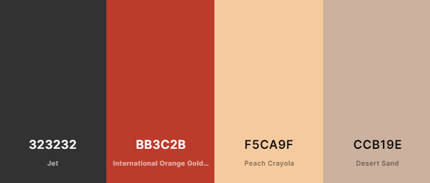

# BoWood Audio

BoWood Audio is a home recording studio that provides a wide range of audio and program editing services. This website's primary intention is to display to the visitor what the setup of the studio is like and what services are available.


## UX

### Scope

The time allocated to build this project was shorter than previous projects, luckily for me, the site owner is very flexible with the scope. The site will be first made to an MVP, and if there is additional time, content/features can be added.

### Visitor Goals

1. As a visitor to this site, I want to see what services are available so I can decide if I want to do business here.
2. As a visitor to this site, I want to see pictures of the studio, so I know what to expect.
3. As a visitor to this site, I want to be able to contact the studio, so that I can make queries or request a booking.
4. As a visitor to this site, I want to be able to view the range of products that are on sale, so that I can make an online purchase.
5. As a visitor to this site, I want to be able to view individual product details, so that I check product details before deciding to purchase.
6. As a visitor to this site, I want to be able to see and post reviews of the products on sale, so that I get a second opinion before i buy or share my opinion with other visitors.

### Owner Goals

1. As the owner of this site, I want a simple landing page, so that visitors can learn about my studio easily and quickly.
2. As the owner of this site, I want to be able to have an online store so I can sell merchandise and gift vouchers.
3. As the owner of this site, I want a receipt/proof of purchase emailed to me and available to myself.
4. As the owner of this site, I want to showcase some of my work, so the user gets an idea of my skills and talent.

### Structure

This full-stack site is put together with HTML, using the bootstrap framework along with some CSS and JavaScript on the frontend.

The frontend is integrated into the backend using Python and Django with a PostgreSQL Database.

### Skeleton

The page content is dynamic and composed of Jinja templates which are put together using Python Django.

#### Website page line up

- Home / Index

- What we do

- Contact

- Gallery

- Login / Logout

- Register new user

- Profile / My details / Edit my Contact details

- All products

- Product details / reviews add/edit/delete

- Shopping bag

- Checkout

- New product addition

### Database Schema

#### Relational Database tables schema


[image source](https://drawsql.app/code-institute-3/diagrams/ms04#)

##### Order table

```bash

    order_number = models.CharField(max_length=32, null=False, editable=False)
    user_profile = models.ForeignKey(UserProfile, on_delete=models.SET_NULL,
                                     null=True, blank=True, related_name='orders')
    full_name = models.CharField(max_length=50, null=False, blank=False)
    email = models.EmailField(max_length=254, null=False, blank=False)
    phone_number = models.CharField(max_length=20, null=False, blank=False)
    country = CountryField(blank_label='Country *', null=False, blank=False)
    postcode = models.CharField(max_length=20, null=True, blank=True)
    town_or_city = models.CharField(max_length=40, null=False, blank=False)
    street_address1 = models.CharField(max_length=80, null=False, blank=False)
    street_address2 = models.CharField(max_length=80, null=True, blank=True)
    county = models.CharField(max_length=80, null=True, blank=True)
    date = models.DateTimeField(auto_now_add=True)
    delivery_cost = models.DecimalField(max_digits=6, decimal_places=2, null=False, default=0)
    order_total = models.DecimalField(max_digits=10, decimal_places=2, null=False, default=0)
    grand_total = models.DecimalField(max_digits=10, decimal_places=2, null=False, default=0)
    original_bag = models.TextField(null=False, blank=False, default='')
    stripe_pid = models.CharField(max_length=254, null=False, blank=False, default='')

```

##### OrderLineItem table

```bash

    order = models.ForeignKey(Order, null=False, blank=False, on_delete=models.CASCADE, related_name='lineitems')
    product = models.ForeignKey(Product, null=False, blank=False, on_delete=models.CASCADE)
    product_size = models.CharField(max_length=2, null=True, blank=True) # XS, S, M, L, XL
    quantity = models.IntegerField(null=False, blank=False, default=0)
    lineitem_total = models.DecimalField(max_digits=6, decimal_places=2, null=False, blank=False, editable=False)

```

##### PhotoGallery table

```bash

    label = models.CharField(max_length=254)
    image_url = models.URLField(max_length=1024, null=True, blank=True)

```

##### Contact table

```bash
# This Model is just used for the contact form rendering, no data is saved

    name = models.CharField(max_length=60)
    email = models.EmailField(max_length=254)
    subject = models.CharField(max_length=60)
    message = models.TextField(max_length=3000)

```

##### Product table

```bash

    category = models.ForeignKey('Category', null=True, blank=True, on_delete=models.SET_NULL)
    sku = models.CharField(max_length=254, null=True, blank=True)
    name = models.CharField(max_length=254)
    description = models.TextField()
    has_sizes = models.BooleanField(default=False, null=True, blank=True)
    price = models.DecimalField(max_digits=6, decimal_places=2)
    rating = models.DecimalField(max_digits=6, decimal_places=2, null=True, blank=True)
    image = models.ImageField(null=True, blank=True)

```

##### UserProfile table

```bash

    user = models.OneToOneField(User, on_delete=models.CASCADE)
    default_phone_number = models.CharField(max_length=20, null=True, blank=True)
    default_street_address1 = models.CharField(max_length=80, null=True, blank=True)
    default_street_address2 = models.CharField(max_length=80, null=True, blank=True)
    default_town_or_city = models.CharField(max_length=40, null=True, blank=True)
    default_county = models.CharField(max_length=80, null=True, blank=True)
    default_postcode = models.CharField(max_length=20, null=True, blank=True)
    default_country = CountryField(blank_label='Country', null=True, blank=True)

```

##### Review table

```bash

    rating = models.DecimalField(max_digits=6, decimal_places=2, null=True, blank=True)
    userid = models.ForeignKey(UserProfile, on_delete=models.CASCADE)
    product = models.ForeignKey(Product, on_delete=models.CASCADE)
    review_title = models.CharField(max_length=90)
    review_text = models.TextField()

```

#### Wireframes of pages

#### Home


#### What we do


#### Contact


#### Gallery


### Surface

#### Colours

Colours were sourced from a work in progress design on branding and logo for BoWood Audio.

Mainly Dark mode using

 #323232 - Graphite or Jet

 #BB3C2B - Tall poppy or International Orange Gold

 #F5CA9F  - Manhattan or Peach Crayola

 #CCB19E -  Rodeo Dust or Desert Sand



#### Icons

Font Awesome is used for icons

#### Images

Images are sourced from Unsplash and the site owner.

#### Fonts

The font used is Oswald from Google fonts.


## Features

### Existing Features

- Online Shop purchases payment can be accepted using the Stripe API.

- Messages inputted on the Contact form are emailed to the site owner.

- The Photo gallery is connected to a database table, so it can be updated by the site owner on an admin portal.

- Visitors have full CRUD access to the product reviews they submit.

- The Product review ratings are updated automatically by [Django signals](https://docs.djangoproject.com/en/3.2/topics/signals/). Each change on the reviews model table triggers the particular product's rating to be re-calculated.

- Results for Products and review listing in the shop are paginated. 

### Features Left to Implement

- Gift Voucher journal handling.

## Technologies Used

### Frontend

#### Languages

- HTML
- CSS
- Python
- JavaScript/Jquery

#### Libraries, Frameworks and Packages include

- [Bootstrap](https://getbootstrap.com/)
- [Jinja](https://jinja.palletsprojects.com/en/2.11.x/)
- Fonts: [Google Fonts](https://fonts.google.com/)
- Icons: [FontAwesome](https://fontawesome.com/v5.15/icons?d=gallery&p=1)
- [django](https://www.djangoproject.com/)
- django-allauth
- pillow
- crispy-bootstrap5
- django-crispy-forms
- stripe
- django-countries
- dj-database-url
- psycopg2-binary
- gunicorn
- boto3
- django-storages

#### Tools

##### Productivity

- [Notion](https://www.notion.so/): I used Notion for documenting personal notes, and planning work.
- Pomodoro timer: [Tomato Clock](https://chrome.google.com/webstore/detail/tomato-clock/enemipdanmallpjakiehedcgjmibjihj) is perfect for keeping my work progressing while also making me take breaks!.
- Kanban planner: [Github projects](https://github.com/kenwals/BoWood-Audio/projects/1).

##### Toolbox

- JSfiddle: I used this online sandbox to build and play code before i adding to the project.
- Wireframe: [Balsamiq](https://balsamiq.com/)
- DB Schema diagram: [Drawsql.app](https://drawsql.app/code-institute-3/diagrams/ms04#)
- IDE: [Visual Studio Code (VS Code)](https://code.visualstudio.com/).
- Virtual Environment: [Pipenv](https://pipenv.pypa.io/en/latest/)
- Version control: Git and GitHub Desktop app
- Markdown editor: [Typora](https://typora.io/) was used when appropriate, VS code editor was used for most updates.
- Markdown Preview Github Styling: this brilliant vscode extension helps me read my markdown in Github format.
- [markdown table of contents creator](https://ecotrust-canada.github.io/markdown-toc/)
- File renaming utility: PowerRename from [PowerToys on Windows 10](https://www.windowscentral.com/how-bulk-rename-your-files-windows-10-powertoys)
- Favicon creator: [favicon.io](https://favicon.io/favicon-generator/)
- Autoprefixer CSS: [Autoprefixer](https://autoprefixer.github.io/)
- Auto formatter for HTML, CSS and JS:  [webformatter](https://webformatter.com/html)
- px to rem convertor: [nekoCalc](https://nekocalc.com/px-to-rem-converter)
- JavaScript linter: [jshint](https://jshint.com/)
- Python linter:  [Pep8 online](http://pep8online.com/)
- Markdown linter: markdownlint extension on VS Code.
- Colour names: [Name that color](https://chir.ag/projects/name-that-color/#6195ED)
- Colour swatches: [Coolors](https://coolors.co/)
- [Grammarly](https://chrome.google.com/webstore/detail/grammarly-for-chrome/kbfnbcaeplbcioakkpcpgfkobkghlhen?hl=en)
- Image editing/cropping: MS Paint

## Testing

### Performance Testing

- Home / Index :heavy_check_mark:

- What we do :heavy_check_mark:

- Contact :heavy_check_mark:

- Gallery :heavy_check_mark:

- Login / Logout :heavy_check_mark:

- Register new user :heavy_check_mark:

- Profile / My details / Edit my Contact details :heavy_check_mark:

- All products :heavy_check_mark:

- Product details / reviews add/edit/delete :heavy_check_mark:

- Shopping bag :heavy_check_mark:

- Checkout :heavy_check_mark:

- New product addition :heavy_check_mark:

### Known issues

#### Not secure warning / Unsecure connection

This Web Application has an ot secure warning displayed on the browser address bar, this prevents me from using certain online tools for responsiveness testing, so i had to manually test these.

#### Pep8 e501 errors

While linting i had to deal with alot of lines of code that exceeded the desired 80 character limit, Which is quite tricky to fix, although i got most of them resolved i had to ignore some linting errors on this project as the code was auto generated by Django.

### Project barriers and solutions

#### Time and work life balance

Finding time to complete this project on schedule was a big push, but i think i have managed to get the MVP delivered.

### Version control

For version control, I used the UI on VS Code for making git commits or the GitHub desktop app, Merging was done on the GitHub site. I used branches when I was working on new features or bundles of changes.

### Functionality Testing

- Home / Index :heavy_check_mark:

- What we do :heavy_check_mark:

- Contact :heavy_check_mark:

- Gallery :heavy_check_mark:

- Login / Logout :heavy_check_mark:

- Register new user :heavy_check_mark:

- Profile / My details / Edit my Contact details :heavy_check_mark:

- All products :heavy_check_mark:

- Product details / reviews add/edit/delete :heavy_check_mark:

- Shopping bag :heavy_check_mark:

- Checkout :heavy_check_mark:

- New product addition :heavy_check_mark:

### Responsiveness Testing

As this web application is not secure, i had to manually test responsiveness with my own devices and Chrome Dev tools.
No issues found on the screen sizes below.

| Screen size                          | Result |
| -------------------------------------------- | ------ |
| iPhone 5/SE DevTools emulation (Screen width 326px) xs | Pass |
| Android Mobile phone (Screen width 412px) xs | Pass |
| Android Tablet (Screen width 600px) sm       | Pass |
| Windows laptop (Screen width 2560px) xxl        |   Pass |

### CSS3 validator

No errors.  Resource: <https://jigsaw.w3.org/css-validator/>

- base.css :heavy_check_mark:

- checkout.css :heavy_check_mark:

- profile.css :heavy_check_mark:

### HTML5 validator

No errors for the pages listed below. Resource: <https://validator.w3.org/>

- Home / Index :heavy_check_mark:

- What we do :heavy_check_mark:

- Contact :heavy_check_mark:

- Gallery :heavy_check_mark:

- Login / Logout :heavy_check_mark:

- Register new user :heavy_check_mark:

- Profile / My details / Edit my Contact details :heavy_check_mark:

- All products :heavy_check_mark:

- Product details / reviews add/edit/delete :heavy_check_mark:

- Shopping bag :heavy_check_mark:

- Checkout :heavy_check_mark:

- New product addition :heavy_check_mark:

### Python validator

No issues. Apart from files I didn't create like the settings, webhooks, migrations.
I believe the below linting error is a false one and can safely be ignored.

```bash
.\checkout\apps.py:9:9: F401 'checkout.signals' imported but unused
```

Resources:  <https://pep8online.com/> and [Flake8](https://flake8.pycqa.org/en/latest/)

### JavaScript validator

No issues. Resource:  <https://jshint.com/>

### Usability Testing

I shared the project on the peer-review channel on slack, and also with friends/family.

I tested and improved accessibility with lighthouse and Firefox developer tools.

Any issues found were resolved.

### Compatibility Testing

| Screen size\Browser                          | Chrome | Firefox | Edge |
| -------------------------------------------- | ------ | ------- | ---- |
| Android Mobile phone (Screen width 412px) xs | Pass | Pass | Pass |
| Android Tablet (Screen width 600px) sm       | Pass | Pass | Pass |
| Windows laptop (Screen width 2560px)         |   Pass |  Pass |  Pass    |

### Testing User Stories

#### Visitor Stories

1. As a visitor to this site, I want to see what services are available so I can decide if I want to do business here.
2. As a visitor to this site, I want to see pictures of the studio, so I know what to expect.
3. As a visitor to this site, I want to be able to contact the studio, so that I can make queries or request a booking.
4. As a visitor to this site, I want to be able to view the range of products that are on sale, so that I can make an online purchase.
5. As a visitor to this site, I want to be able to view individual product details, so that I check product details before deciding to purchase.
6. As a visitor to this site, I want to be able to see and post reviews of the products on sale, so that I get a second opinion before I buy or share my opinion with other visitors.

#### Owner Stories

1. As the owner of this site, I want a simple landing page, so that visitors can learn about my studio easily and quickly.
2. As the owner of this site, I want to be able to have an online store so I can sell merchandise and gift vouchers.
3. As the owner of this site, I want a receipt/proof of purchase emailed to me and available to myself.
4. As the owner of this site, I want to showcase some of my work, so the user gets an idea of my skills and talent.

## Deployment

I developed this application in VScode, While developing this application I used a virtual environment called [pipenv](https://pipenv.pypa.io/en/latest/). I would recommend you do the same. This repo includes the pipenv compatible dependency setup files, the only thing you need to configure is the environmental variable file (filename: ".env").

**Please note** This project contains several Environmental variable keys that will not work outside of this project without you refactoring in your keys. Here is a sample of the Environmental variables file I used with keys masked. You will need to replace it with your own.

```bash

STRIPE_PUBLIC_KEY=SECRET_KEY
STRIPE_SECRET_KEY=SECRET_KEY
STRIPE_WH_SECRET=SECRET_KEY
SECRET_KEY=SECRET_KEY
EMAIL_HOST_PASS=SECRET_KEY
EMAIL_HOST_USER=email_address
DEVELOPMENT=True
```

### Pre-Requisites for Deployment

You will need :

- [Python](https://www.python.org/) installed

- A [Stripe](https://stripe.com/ie) account

- An email address STMP server password or passkey.

- A Django Secret Key. Get one [here](https://djecrety.ir/)

- An [Heruko](https://www.heroku.com/) account with a PostGresSQL app installed.

- A [GitHub](https://github.com/) account.

### Local Deployment

To deploy locally on your preferred Desktop IDE, you can clone the repository to your desktop by the following steps.

1. Go to [the BoWood Audio github page](https://github.com/kenwals/bowood-audio).
2. Above the list of files, click on the **code** button.
3. To clone the repository using **HTTPS,** under "Clone with HTTPS", click the paste icon.
   To clone the repository using an **SSH key**, click Use SSH, then click the paste icon.
   To clone a repository using **GitHub CLI,** click Use GitHub CLI, then click the paste icon.
4. Open your preferred Terminal interface.
5. Change the current working directory to the location where you want the cloned directory.
6. Type **git clone**, then paste the URL you copied earlier above. Example below is HTTPS for a Windows PC.

    ```bash
    git clone https://github.com/kenwals/BoWood-Audio.git
    ```

7. Press Enter to create your local clone. more detailed instructions are available [here](https://docs.github.com/en/free-pro-team@latest/github/creating-cloning-and-archiving-repositories/cloning-a-repository)

### For VScode and Pipenv

1. To run the manage.py in VScode terminal you will need supporting Environmental variables inputted in the .env file(example above).
2. Your VScode should have Python installed already, if it does please ensure it's there by entering the command below.

    ```bash
    python --version
    ```

3. Now you need to install Pipenv, enter the command below.

    ```bash
    pip install pipenv
    ```

4. As this repository has the setup files made already, you can start the environment by entering the command below. More info on Pipenv [here](https://www.youtube.com/watch?v=6Qmnh5C4Pmo) and [here](https://pipenv.pypa.io/en/latest/)

    ```bash
    pipenv shell
    ```

5. You should notice a message like below saying loading ".env environment variables..." this is good, it means your keys are in place.

    

6. Now to run the application on your desktop, enter the command below and open <http://localhost:8000/> on your preferred browser.

    ```bash
    python manage.py runserver
    ```

### Heroku

Heroku is a cloud platform that can hosts dynamic web applications. Once you have the completed site in your repository, you can deploy it to Heroku by the following steps.

1. Before you set up Heroku, you first need to create some files that are necessary for it to run on the Heroku server.
2. Open a terminal window in your IDE on the root folder of the project, run the command below, this will create a new file called procfile.

    ``` echo web: gunicorn bowood.wsgi:application > Procfile ```

3. Now run the command line below. this will create a new file called requirements.txt

    ``` pip3 freeze --local > requirements.txt ```

4. Create a [Heroku user account](https://signup.heroku.com/login)
5. Click on the New button and choose to create a new app.
6. Input an app name and choose a region that is closest to you.
7. To input the necessary environmental variables, simply go to the Settings tab, and under Config Vars, Click on Reveal Config Vars
8. Now you can deploy, the simplest way is to deploy from github, Click on the Deploy tab, Under Deployment method click on Github. A search window will prompt you to connect to the appropriate repository. You can then choose to do a manual or automatic deployment.

### Contribution and Forking

You may wish to contribute to this website and have your contribution published, if so, you are welcome to follow these steps below.

1. Go to the GitHub website and log in.
2. Open <https://github.com/kenwals/bowood-audio>
3. In the top right-hand corner, you will see a fork button, click on this **Fork button**.
4. This will create a copy of the BoWood Audio repository in your Github account.
5. Run the project locally and make your required changes.
6. You can push these changes to your repository.
7. Once you're finished making changes you can locate the **New Pull Request** button just above the file listing in the original repository (<https://github.com/kenwals/bowood-audio>).
8. Your pull request will be reviewed and if approved, it will be merged into the main version of the BoWood Audio repository at a future date.

more detailed instructions are available [here](https://docs.github.com/en/free-pro-team@latest/github/getting-started-with-github/fork-a-repo)

## Credits

### Content

- The foundation of this site is sourced from [Code Institute Educational material - Boutique Ado](https://github.com/Code-Institute-Solutions/boutique_ado_v1)
- The Review app is influenced by [LigaMoons Prikly](https://github.com/LigaMoon/Prickly/tree/main/reviews)
- BoWood Audio is a home studio belonging to Paul O'Hara (aka Lego from the band Royseven), content was provided by Paul O'Hara and Paul Walsh.
- Points of reference used for making this web app were [Camden Recording Studios](https://www.camdenrecordingstudios.com/) and [Grouse Lodge](http://grouselodge.com/).

### Resources

- [Trick used for navbar icon](https://stackoverflow.com/questions/42586729/how-can-i-change-the-bootstrap-4-navbar-button-icon-color)

- Codemy.com youtube videos on Django contact page setup [here](https://www.youtube.com/watch?v=xNqnHmXIuzU) and
[here](https://www.youtube.com/watch?v=w4ilq6Zk-08)

- CodingEntrepreneurs youtube video on [how to use Django signals](https://www.youtube.com/watch?v=rEX50LJrFuU)

- [How to make javascript dynamic to screen width](https://stackoverflow.com/questions/17237935/jquery-execute-scripts-based-on-screen-size/17237975). This is used on the homepage to make the navbar background transparent on mobile for this initial load.

- [How to add favicon to Django in 4 steps](https://simpleit.rocks/python/django/django-favicon-adding/)

- Pagination in Django [here](https://docs.djangoproject.com/en/3.2/topics/pagination/) and [here](https://www.ordinarycoders.com/blog/article/django-pagination)

- [Crash course in Pipenv](https://www.youtube.com/watch?v=6Qmnh5C4Pmo)

- [Bootstrap components](https://getbootstrap.com/)

- [W3schools](https://www.w3schools.com/)

- [Code institute's Slack workspace channels](https://slack.com)

- [Stack Exchange](https://stackexchange.com/)

- [MDN Web Docs](https://developer.mozilla.org/en-US/)

### Media

Product Images that were sourced from Unsplash are credited below:

1. Mug          [https://unsplash.com/photos/nDd3dIkkOLo](https://unsplash.com/photos/nDd3dIkkOLo)
2. T-shirt       [https://unsplash.com/photos/m1MRYp556Ew](https://unsplash.com/photos/m1MRYp556Ew)
3. Sweatshirt     [https://unsplash.com/photos/ikLELWYbyxk](https://unsplash.com/photos/ikLELWYbyxk)
4. Baseball cap   [https://unsplash.com/photos/b9hqQkKCnqw](https://unsplash.com/photos/b9hqQkKCnqw)
5. Drum sticks    [https://unsplash.com/photos/bRG2C0FAQEY](https://unsplash.com/photos/bRG2C0FAQEY)  
6. Water Bottle   [https://unsplash.com/photos/POAQXzBwF7g](https://unsplash.com/photos/POAQXzBwF7g)
7. Gift Voucher 50 euro  [https://unsplash.com/photos/RNlVIhXrz-Y](https://unsplash.com/photos/RNlVIhXrz-Y)
8. Gift Voucher 20 euro  [https://unsplash.com/photos/HwU5H9Y6aL8](https://unsplash.com/photos/HwU5H9Y6aL8)
9. Guitar pick  [https://unsplash.com/photos/s2efxWujA-o](https://unsplash.com/photos/s2efxWujA-o)
10. Bottle opener  [https://unsplash.com/photos/voJB2goG0us](https://unsplash.com/photos/voJB2goG0us)
11. Tea towel [https://unsplash.com/photos/8yIYQDR8Qr8](https://unsplash.com/photos/8yIYQDR8Qr8)
12. Tote Bag [https://unsplash.com/photos/nKK32qJheBY](https://unsplash.com/photos/nKK32qJheBY)

### Acknowledgements

- Thanks to the Lego and Paul from BoWood Audio.
- My Mentor [Maranatha Ilesanmi](https://github.com/mbilesanmi) for helpful guidance throughout.
